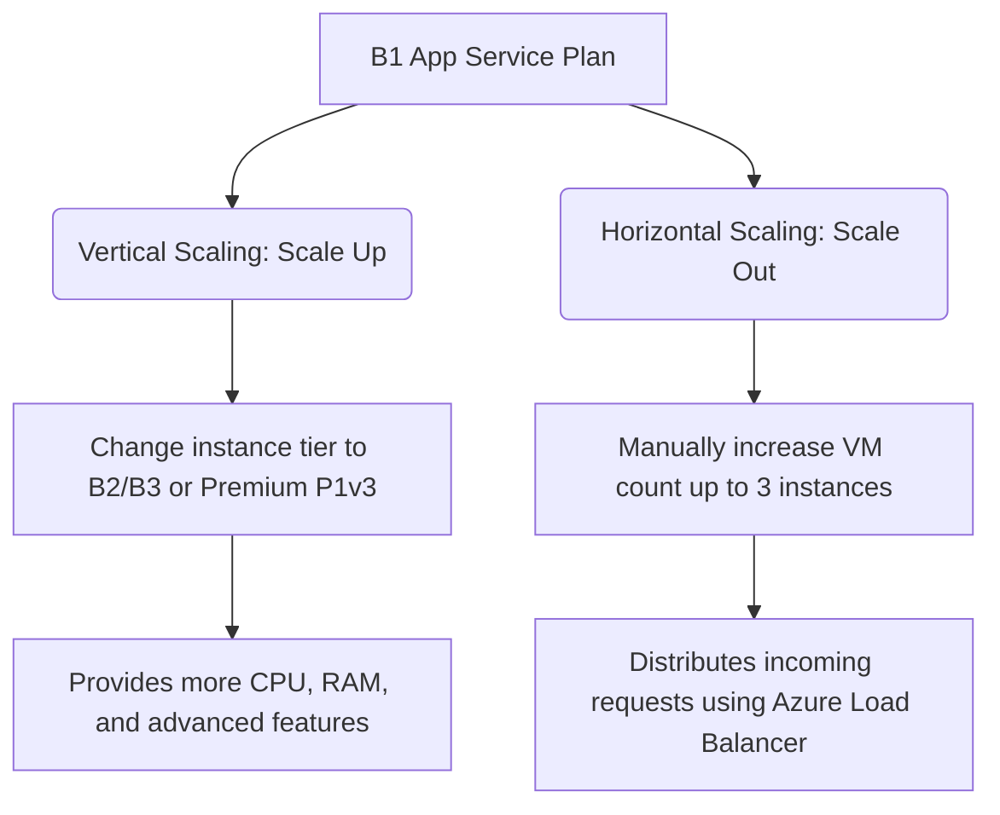

# Azure Node.js Deployment & Architecture

A production-ready Node.js Express web application deployed to Microsoft Azure App Service (PaaS). This project serves as a showcase of cloud-native deployment patterns, automated CI/CD workflows, secure application configuration, and proactive monitoring/scaling strategies.

## Live URL

🔗 **[http://olamc-agg8fjdffgbbendg.westeurope-01.azurewebsites.net](http://olamc-agg8fjdffgbbendg.westeurope-01.azurewebsites.net)**

---

## Folder Structure

```text
azure-node-app/
├── .github/workflows/       # GitHub Actions CI/CD workflows (auto-generated by Azure)
├── public/                  # Static assets (stylesheets, client-side JS)
│   └── style.css            # Custom layout styles
├── views/
│   └── index.ejs            # EJS template for rendering environment variables
├── app.js                   # Express application entry point & health check
├── package.json             # App manifest, start scripts, engine config
├── summary.txt              # Executive deployment overview
└── README.md                # Comprehensive deployment documentation
```

---

## Technical Stack & Architectural Justifications

To achieve a stable, high-performance, and cost-effective deployment, the following architecture decisions were selected and implemented:

### 1. App Service Plan Pricing Tier: Basic (B1)
- **Why B1?** The **Basic B1** tier is selected because it provides **dedicated compute resources** (A-series equivalent VM), avoiding the strict daily usage caps (60 CPU minutes/day) and memory limits of the Free (F1) tier.
- **Key Features Included:**
  - **Always On:** Prevents the application container from going idle and suffering long cold starts.
  - **Custom Domain & SSL Support:** Allows securing the endpoint with custom branding.
  - **Manual Scale-out:** Supports scaling out to up to 3 instances to handle increased load.
  - **Telemetry Integration:** Full integration with Azure Monitor and Application Insights.

### 2. Region: West Europe
- **Why West Europe?** This region was chosen to minimize latency for European developers and users. Additionally, deploying within West Europe ensures compliance with strict European data sovereignty and privacy regulations (such as **GDPR**). West Europe also boasts excellent resource availability and network peering connections.

### 3. Runtime: Node.js 22 LTS
- **Why Node.js 22 LTS?** Node.js 22 is the current Long-Term Support (LTS) release, offering a balance of modern ECMAScript features, enhanced performance (V8 engine enhancements), and guaranteed long-term security and stability patches.

### 4. Operating System: Linux
- **Why Linux?** Running Azure App Service on **Linux** executes the application inside a native Docker container. This minimizes runtime overhead, speeds up cold start times, offers native compatibility with npm packages, and is significantly cheaper compared to Windows-based App Service plans.

---

## Detailed Step-by-Step Deployment Guide (GitHub CD)

Continuous deployment is implemented using **GitHub Actions** and the **Azure App Service Deployment Center**:

1. **Repository Setup:** Push the local application source code to a public/private GitHub repository.
2. **Azure Deployment Center Configuration:**
   - Navigate to the **App Service** in the Azure Portal.
   - Go to the **Deployment Center** blade.
   - Select **GitHub** as the source provider and authenticate your account.
   - Select the organization, repository, and set the branch to `main`.
3. **Workflow Automation:**
   - Azure automatically generates a GitHub Actions workflow YAML file and commits it directly to `.github/workflows/` in the repository.
   - On every `git push` to `main`, GitHub Actions triggers a build run.
4. **Build & Oryx Execution:**
   - The runner starts a container, checkout the code, and utilizes **Oryx** (Azure's build engine) to detect the runtime.
   - Oryx automatically runs `npm install` and compiles assets if necessary.
5. **Deployment:** The build output is packaged and deployed directly to the App Service. The service performs a zero-downtime rolling update.

---

## Environment Variables Configuration

The application reads variables at runtime from the system environment (`process.env`), keeping configurations secure and separate from source code:

| Variable | Purpose | Value in Production |
| :--- | :--- | :--- |
| `APP_ENV` | Identifies the runtime environment | `production` |
| `APP_NAME` | Display name shown in the UI | `Azure Node App` |

### Setting Environment Variables in Azure:
1. Navigate to the **App Service** in the Azure Portal.
2. Under the **Settings** menu, select the **Configuration** blade (or **Environment variables** in newer portal layouts).
3. Under **Application Settings**, click **+ New application setting**.
4. Add the Name (e.g., `APP_ENV`) and Value (e.g., `production`).
5. Click **Apply** and then **Save** at the top of the page. This restarts the App Service to apply changes safely.

---

## Monitoring and Diagnostics Guide

Proactive monitoring is essential for maintaining application health and troubleshooting failures.

### 1. How to Access Metrics
- **Where to find:** Azure Portal -> App Service -> **Metrics** blade.
- **How to use:**
  - Select metrics like **CPU Percentage**, **Memory Working Set**, **Average Response Time**, or **Http 5xx** errors.
  - Set the time aggregation (e.g., last 30 minutes, last 24 hours) to visualize trends and trace performance bottlenecks.

### 2. How to Access Log Stream (Real-Time Logs)
- **Prerequisite:** Enable Application Logging first:
  1. In Azure Portal, go to **App Service Logs** blade.
  2. Toggle **Application Logging (FileSystem)** to **On** and set the Quota/Retention period. Click **Save**.
- **Viewing Logs:**
  - Navigate to the **Log Stream** blade.
  - Here you will see live console outputs (stdout/stderr) generated by `console.log` in `app.js` (e.g. `Server running on port...`).

### 3. Application Insights Integration
- **Where to find:** Azure Portal -> App Service -> **Application Insights** blade.
- **Capabilities:**
  - **Application Map:** Visually traces dependencies and response delays.
  - **Transaction Search:** Searches for specific failed requests and provides detailed stack traces.
  - **Live Metrics:** Shows CPU, Memory, and incoming requests with sub-second latency.

---

## Scaling and Optimization Strategies

The **Basic B1** plan supports both vertical and horizontal scaling.



### 1. Manual Scale-Out (Horizontal)
- **Capability:** Manually increase the instance count from `1` up to `3` servers. Azure automatically configures a load balancer to distribute traffic evenly across instances.
- **Auto-Scale Note:** Auto-scaling (rules-based scaling based on metrics like CPU % exceeding 70%) is **not supported** in the B1 tier. To use auto-scale, you must scale up to the **Standard (S1)** tier or higher.

### 2. Scale-Up (Vertical)
- **Capability:** Upgrade the hardware specs (e.g., moving to B2, B3, or Premium P1v3 plans).
- **When to upgrade pricing tier:**
  - To gain access to Auto-scaling.
  - To utilize deployment slots (staging/production testing) for zero-downtime releases (requires Standard S1+).
  - To enable automatic backups.

### 3. When to Scale
- **Scale Out (Horizontal):** When the application experiences heavy concurrent traffic and the CPU/Memory utilization of the single instance exceeds 70% or average latency spikes.
- **Scale Up (Vertical):** When the app runs out of memory (B1 provides 1.75 GB RAM) causing Out of Memory (OOM) crashes, or if features like staging slots, custom VNets, or backups are required.

---

## Troubleshooting Guide

### 1. "Application Error" or "Container Crashing"
- **Cause:** Often caused by a runtime error, unhandled exception, or port configuration issue.
- **Solution:**
  1. Open the **Log Stream** blade in the Azure Portal to check the stack trace.
  2. Verify that your server binds to `process.env.PORT` (not a hardcoded port like `3000` or `8080`). Azure App Service dynamically injects the correct port to bind to.

### 2. Deployment Fails or "Oryx Build Error"
- **Cause:** Missing dependencies or incompatibility with Node runtime versions.
- **Solution:**
  1. Check deployment logs in the **Deployment Center** -> **Logs** tab.
  2. Ensure the `package.json` contains a valid `"start"` script.
  3. Verify that your local Node.js version is compatible with the version configured in Azure (configured via the runtime stack setting).

### 3. Changes Don't Appear After Push
- **Cause:** GitHub Actions build might have failed, or deployment is still in progress.
- **Solution:**
  1. Open the **Actions** tab in your GitHub repository and check if the deployment workflow succeeded.
  2. Ensure that you pushed your commits to the correct branch (`main`) configured in the Deployment Center.

### 4. "Always On" Configuration Issues
- **Cause:** Application feels slow to load on the first request after being idle.
- **Solution:**
  1. Go to the **Configuration** -> **General Settings** blade.
  2. Ensure that the **Always On** toggle is set to **On** (only available on B1 and higher tiers).

---

## Running Locally

To test the application locally before deploying:

1. Clone this repository to your local machine.
2. Install dependencies:
   ```bash
   npm install
   ```
3. Run the development server:
   ```bash
   npm start
   ```
4. Access the application in your browser at `http://localhost:3000`.
